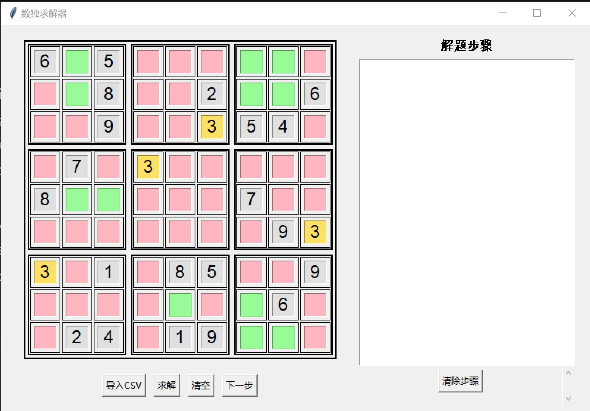

# Sudoku Solver with Step-by-Step Visualization

A Python-based Sudoku solver with GUI that demonstrates the solving process step by step using various solving techniques.

## Screenshot



## Features

- Interactive 9x9 Sudoku board
- CSV file import support
- Step-by-step solving visualization
- Multiple solving techniques:
  - Single Candidate Method
  - Single Position Method
  - Naked Pairs Method
  - Block-Line Reduction Method
- Interactive candidate analysis
- Color-coded visualization for number placement analysis

## Usage

1. **Input Methods**:
   - Manually enter numbers on the board
   - Import CSV file (Format: 9x9 grid, empty cells as blank or 0)

2. **Solving Options**:
   - Click "Solve" for complete solution
   - Click "Next Step" for step-by-step solving
   - Click "Clear" to reset the board

3. **Interactive Analysis**:
   - Click any filled number to see placement possibilities:
     - Yellow: Same numbers
     - Green: Valid positions
     - Red: Invalid positions
     - Gray: Occupied cells
   - Click empty cells to see candidate analysis

## Requirements

- Python 3.x
- tkinter (usually comes with Python)

## Running the Program
```bash
python main.py
```

## File Structure

- `main.py`: Main program entry
- `gui/board.py`: GUI implementation
- `solver/board.py`: Sudoku solving logic